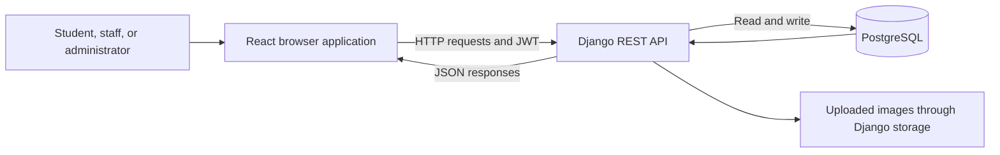
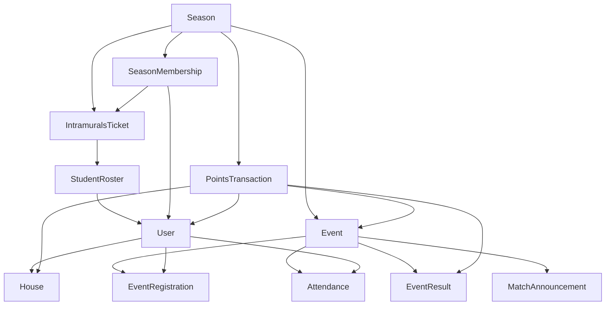

# Understanding ACLCxp: a guide to the whole system

This guide is for the person who owns and maintains ACLCxp, including someone learning programming while building it. Read it from top to bottom once, then use the file maps when working on a particular feature.

Reviewed against the repository on **11 October 2026**. This describes the code in this checkout; hosting settings, live data, and deployed versions were not inspected. Paths below are relative to the repository root. Older documents and comments can describe earlier versions; follow the current routes, permissions, and implementation when they disagree.

## 1. What the system does

ACLCxp manages campus activities for ACLC College of Tacloban. It connects school-controlled student records, accounts, seasonal access tickets, event registration, staff-approved attendance, competition results, and points for students and houses.

Think of it as three cooperating parts:

1. **React frontend:** the screens people use in their browsers.
2. **Django backend:** the rules, authentication, API, and database operations.
3. **PostgreSQL database:** the durable records that survive closing a browser or restarting the server.

The frontend asks the backend to do things. The backend decides whether the request is allowed, changes records if necessary, and returns data. The frontend then displays that data.



The repository documents Vercel for the frontend, Render for Django, and Neon for PostgreSQL. Those are deployment choices, not separate pieces of business logic.

**Your AI coding subscription is not a runtime dependency of this application.** The inspected application uses ordinary React, Django, and database code. The support chat matches keywords to answers stored in its source. The old `apps.ai` backend is kept for migration history and is not mounted as a current API. Hosting and database services have their own accounts and billing, independent of the tool used to write the code.

## 2. The vocabulary you will see in the code

| Term | Meaning in this project |
| --- | --- |
| Component | A React function that builds part of a screen, such as a scanner or modal. |
| Page | A component representing a complete screen, usually inside `frontend/src/pages/`. |
| Route | A mapping from a URL to a page or backend handler. Browser routes and API routes are different. |
| API endpoint | A backend URL the frontend calls, such as `/api/auth/login/`. |
| JSON | The structured data format used for most API requests and responses. |
| Model | A Python definition of a database record and its relationships. |
| Serializer | Code that validates incoming fields and converts records to API data. |
| View / ViewSet | Backend code that handles a request. A ViewSet groups related operations. |
| Service | A function containing reusable rules, such as registration or check-in. |
| Middleware | Code surrounding request handling, such as season enforcement and audit logging. |
| Migration | A versioned database change. Editing a model alone does not update the database. |
| JWT | A signed login token sent with authenticated API requests. |
| Query / mutation | Reading server data / changing server data in TanStack Query. |
| Transaction | A group of database changes that either completes together or rolls back. |
| Row lock | A way to prevent simultaneous requests from modifying the same record inconsistently. |

An `id` is a record's database identifier. A field ending in `_id`, such as `event_id`, normally stores a link to another record. A foreign key expresses that link in a model.

## 3. Where the code lives

```text
aclcxp/
  backend/
    manage.py                 Django command entry point
    requirements.txt          Python dependencies
    render_build.py           Deployment installation, static files, migrations
    config/
      urls.py                 Root API and Django admin routing
      settings/
        base.py               Shared settings
        development.py        Local settings
        production.py         Deployed settings
        test.py               Isolated SQLite tests
        test_postgres.py      PostgreSQL tests
    apps/                     Business modules
  frontend/
    package.json              JavaScript dependencies and commands
    vite.config.ts            Frontend development/build tooling
    vercel.json               Hosting rules for browser routes
    src/
      main.tsx                Application bootstrapping and providers
      App.tsx                 Starts application routes
      routes/                 Page routing and login/role guards
      context/AuthContext.tsx Current signed-in user
      pages/                  Public, authentication, student, and admin screens
      components/             Reusable screen parts
      services/               API client, data fetching, caching, helpers
      ui/                     Shared visual utilities
      mocks/                  Mock API data for development/testing
    scripts/                  Focused UI and behavior validation scripts
  docs/                       Operational and feature documentation
```

### Backend responsibility map

| Module | Main responsibility | Start reading here |
| --- | --- | --- |
| `users` | Accounts, official roster, access tickets, persistent QR record, profile updates | `backend/apps/users/models.py` |
| `authentication` | Ticket verification, student verification, activation, login, refresh, logout | `backend/apps/authentication/views.py` |
| `seasons` | Current season, membership, access enforcement, closure, export and purge | `backend/apps/seasons/models.py`, `scope.py`, `middleware.py`, `views.py` |
| `events` | Categories, events, teams, registration, waitlists, eligibility, event artwork | `backend/apps/events/models.py`, `services.py`, `views.py` |
| `attendance` | Attendance and scan-log database records | `backend/apps/attendance/models.py` |
| `results` | Matchups, brackets, results, points records, public competition feed | `backend/apps/results/models.py`, `management.py` |
| `houses` | Houses and house-related records/endpoints | `backend/apps/houses/models.py`, `views.py` |
| `analytics` | Admin console, student reports, attendance operations, scoring helpers, settings, audit logs | `backend/apps/analytics/urls.py`, `console.py`, `portal.py`, `operations.py` |
| `core` | Shared models, permissions, errors, pagination, media storage and field limits | `backend/apps/core/` |
| `notifications` | Notification/email record definitions and migration history | `backend/apps/notifications/models.py` |
| `ai` | Migration history for removed AI tables | `backend/apps/ai/migrations/` |

The name `analytics` understates its role: it contains many operational features, including attendance and points writes. Do not assume all attendance logic is inside `apps/attendance` or all scoring logic is inside `apps/results`.

An installed Django app is not necessarily an exposed feature. Check `backend/config/urls.py` and its included URL files to see which handlers actually receive requests. Notifications and AI have no direct URL include there.

## 4. The records and how they connect

| Record | What it represents | Scope |
| --- | --- | --- |
| `User` | Login account, identity, role, house and profile | Persists across seasons |
| `StudentRoster` | School-approved student identity and eligibility; optional account link | Persists across seasons |
| `House` | A competing house and its branding | Persists across seasons |
| `Season` | One campus competition period, its stage and academic year | One lifecycle record |
| `IntramuralsTicket` | A school-issued access ticket, with redemption state and owner | One season |
| `SeasonMembership` | Account's membership linked to its redeemed ticket | One user per season |
| `QRCode` | Persistent, revocable student pass credential | One per account |
| `EventCategory` | A reusable grouping such as sports or cultural activities | Shared |
| `Event` | Schedule, audience, registration rules, attendance mode and point values | One season |
| `EventTeam` | A house team for an event, with members and optional photo | One event |
| `EventRegistration` | A student's reservation, waitlist or attendance status | One event and user |
| `Attendance` | Recorded check-in, approving operator and validity | One event and user |
| `ScanLog` | Scan-operation history | Season-linked |
| `MatchAnnouncement` | Two sides in a match, optionally fed by earlier match winners | One event |
| `EventResult` | An individual, team or house competition result | One event |
| `PointsTransaction` | An award, penalty, bonus or correction, with its source and approval state | Season-linked |
| `SystemSetting` | Configurable portal behavior | Shared |
| `AuditLog` | Recorded administrative/request activity | Season-linked where applicable |
| `UploadedImage` | Durable image bytes for database-backed storage | Storage record |



This is a conceptual relationship map, not a complete database schema. For exact fields and constraints, use the model files and migrations.

### Four concepts that are easy to confuse

- **Account:** who can sign in.
- **Roster:** who the school recognizes as an eligible student.
- **Season ticket and membership:** whether that student has access to the current competition.
- **Event registration:** whether the student has reserved a place in one activity.

Creating an account does not automatically grant seasonal access. Redeeming a season ticket does not automatically reserve every event. Registering for an event does not prove attendance.

There are also two different QR uses: the **issued ticket QR** grants seasonal access through redemption; the **student pass QR** lets staff resolve and confirm a student's identity for attendance.

## 5. How login and access work

### New student

The registration screen in `frontend/src/pages/auth/RegisterPage.tsx` calls the ticket-verified flow:

1. Verify a school-issued ticket through `/api/auth/registration/verify-ticket/`.
2. Verify the official student record through `/api/auth/registration/verify-student/`.
3. Activate through `/api/auth/registration/activate/`.

The backend validates this process; it does not simply trust a browser saying verification succeeded. Read `backend/apps/authentication/views.py` for the exact activation rules.

The older `/api/users/register/` endpoint deliberately returns HTTP 410 and directs callers to ticket verification. The `register()` helper still present in `frontend/src/services/auth.ts` points at that old endpoint; it is not the current registration flow.

### Returning student

The student uses the same account in a later season, signs in when registration or activity is open, and redeems a new current-season ticket through `/api/seasons/redeem/`.

### Login session

1. The frontend posts student ID and password to `/api/auth/login/`.
2. The backend returns access and refresh tokens.
3. `services/auth.ts` saves them in browser `localStorage`.
4. `AuthContext.tsx` calls `/api/auth/me/` to obtain current user information.
5. `services/api.ts` adds `Authorization: Bearer ...` to authenticated requests.
6. When a request receives 401, the client can refresh and retry once. Concurrent refresh attempts share one pending promise.
7. Logout clears tokens and cached query data; the backend logout handles refresh-token invalidation.

Shared settings configure access tokens for one hour and refresh tokens for seven days, with refresh rotation and blacklisting. A token proves a login session; season access and role checks still apply.

### Roles

| Role | Frontend workspace | Relevant backend behavior |
| --- | --- | --- |
| `STUDENT` | Dashboard, profile, events, statistics, merit sheet | Own data and valid current-season access |
| `STAFF` | Attendance workspace | Attendance approval permission |
| `ORGANIZER` | Attendance workspace | Attendance approval; event API also permits managing owned events |
| `ADMIN` | Admin console and attendance workspace | School administration permissions |

`ProtectedRoute.tsx` controls which screens appear. Backend permission checks provide the actual enforcement. Hiding a button alone does not secure an API.

Some older TypeScript types and helpers mention `FACILITATOR` or `HOUSE_LEADER`; the current `User.ROLE_CHOICES` defines the four roles above. Django's `is_staff` flag controls Django admin access and is distinct from the application's `STAFF` role.

## 6. Seasons are the main operating boundary

The lifecycle is **Draft → Registration → Active → Closed**, with explicit administrator actions. Planned dates alone do not start or close a season. Only one season can be current.

| Stage | Student experience | Operational meaning |
| --- | --- | --- |
| No current season / Draft | Student sessions are blocked | Setup is required |
| Registration | Restricted enrollment and ticket redemption | Prepare access before activities |
| Active | Workspace available with valid ticket-backed membership | Attendance, results and scoring can operate |
| Closed | Student access blocked | Operational writes locked; archival workflow available |

`SeasonMiddleware` checks protected requests, including existing sessions. `valid_membership()` checks the membership's own ticket, matching season, redeemed state, account ownership, and roster eligibility. A membership row alone is insufficient.

Many operational models use `SeasonManager`: normal `.objects` queries are automatically restricted to the current season. Their `.all_objects` manager allows explicit cross-season queries. When there is no current season, the manager preserves legacy query behavior, while student access still fails closed.

This distinction matters when investigating apparently missing records: they may belong to an older season rather than having been deleted.

### Academic year and championship points

Seasons with the same academic year contribute approved, non-reversed transactions to championship reporting; draft seasons are excluded. Attendance, tickets, registrations and operational work remain tied to the current season. Points are aggregated from their original records rather than copied into the next season.

For example, linking Intramurals and ACLC Week to `2026-2027` combines their championship points, but a student still needs an ACLC Week ticket to participate in ACLC Week.

### Close, export and purge

Closing retains records and prevents further operational changes. Export creates a reporting ZIP with records, CSVs, artwork where available, and a manifest. Purge is a separate deletion workflow with export validation and confirmation. Linked academic-year seasons cannot be purged through this workflow because their history is needed for championship totals.

A season export is **not a complete restorable database backup**. The application has no automatic archive import/restore feature. See [the season guide](seasons.md) before performing either archival or deletion work.

## 7. Events and registration

An event has its own lifecycle: Draft → Published → Ongoing → Completed, with cancellation allowed from Draft or Published. Finalized events cannot be edited through the normal update service.

Separate event properties answer separate questions:

- **Visibility and audience restrictions:** who can see or join it?
- **Registration required:** must a student reserve a confirmed place?
- **Capacity and waitlist:** how many confirmed reservations can exist?
- **Attendance mode:** per-event check-in, daily approval, or no attendance requirement?
- **Point values:** how much participation or placing earns?

`backend/apps/events/services.py` implements eligibility, registration windows, capacity, cancellation and waitlist promotion. `views.py` receives requests and calls these rules while locking the event row.

### Example: a student registers for basketball

1. `EventsPage.tsx` reads the event list from the API.
2. The student submits a registration request to `/api/events/{id}/register/`.
3. Django checks current-season membership, audience restrictions, event state and registration dates.
4. It locks the event while allocating capacity.
5. It creates or reuses the student's `EventRegistration`: confirmed if space exists, otherwise waitlisted if allowed.
6. The frontend refreshes affected cached data and displays the outcome.

Repeated requests reuse an existing active registration. Cancellation can release a confirmed slot and promote an eligible waiting student. PostgreSQL locks and database constraints protect this process against concurrent requests.

`PRIVATE` events currently have no invitation-management implementation in the eligibility service; do not assume private invitations exist simply because the visibility choice exists.

## 8. Attendance and the student pass

The student pass is generated from a signed payload tied to a stored nonce and version in `QRCode`. The backend checks its signature, record status, version, expiry if configured, and account status. The current persistent pass is not automatically limited to five minutes; legacy short-lived passes are supported separately.

### Daily approval

1. Staff scans a student pass or enters a student number.
2. `/api/attendance/preview/` returns identity details and a signed confirmation proof.
3. Staff checks the identity and confirms.
4. `/api/attendance/daily/` validates the confirmation proof, which expires after five minutes.
5. Eligible daily-mode events for the selected school day are processed.
6. The response distinguishes newly approved events, existing records and skipped events with reasons.

Daily approval uses the **Asia/Manila** calendar day and rejects future dates. It still respects event eligibility and confirmed registration where required. It does not approve every activity indiscriminately.

### Per-event check-in

The admin attendance API calls the shared `check_in()` operation. Per-event attendance requires an ongoing event. Daily-mode events use the daily workflow, and `NONE` events reject attendance recording.

On successful check-in, the operation creates attendance, updates registration when present, increments the event attendance count, awards participation points, and records a successful scan log in a transaction. An existing valid attendance is reused, preventing another award for the same student/event.

Corrections use `correct_attendance()` to change validity, registration status, counters and the corresponding point transaction together. Changing an attendance row manually can leave these dependent values inconsistent.

Read these files together:

- UI: `frontend/src/pages/admin/StaffAttendancePage.tsx`, `components/admin/QRScanner.tsx`, `IdentityConfirmation.tsx`, `EventAttendance.tsx`.
- API: `backend/apps/analytics/daily_attendance.py`, `console.py`.
- Shared rules: `backend/apps/analytics/student_pass.py`, `operations.py`.
- Records: `backend/apps/attendance/models.py`.

## 9. Results, brackets and points

These are related but distinct features:

- **Matchups/brackets** describe who competes and who advances. A side can be supplied by the winner of an earlier match. Validation prevents cyclic links and incompatible participants.
- **Event results** record placing or performance for an individual, team or house.
- **Points transactions** record the scoring effect, with source, reason, actor and approval/reversal information.

A bracket winner is not itself the point ledger. Inspect result and scoring handlers before assuming a match outcome awards points automatically.

`post_points()` uses a unique `source_key`, such as `attendance:{id}` or `result:{id}`, to avoid awarding the same source twice. Manual requests also use keys to make retries safe. Result corrections reverse prior effective awards and can create replacement awards.

Reporting counts transactions where **`is_approved=True` and `is_reversed=False`**. Reversing an award preserves its history while removing its effect from totals. Negative transactions can represent deductions.

`House.total_points` is also updated by scoring operations, but portal/console championship reporting uses effective transaction aggregates. Treat the transactions as the scoring history; do not repair scores by editing a house counter alone. House awards remain credited to the house stored on the original transaction if a student later changes houses.

Start with `backend/apps/analytics/operations.py`, `console.py`, `portal.py`, and `backend/apps/results/management.py`. Detailed behavior is in [the tournament guide](tournament-brackets.md) and [student pass and leaderboard guide](student-pass-and-leaderboard.md).

## 10. How the frontend is organized

`main.tsx` wraps the application in providers for server-data caching, browser routing, theme, and authentication. `App.tsx` renders `AppRoutes.tsx`, which loads pages lazily as needed.

| Browser URLs | Screen area |
| --- | --- |
| `/`, `/results`, `/about`, `/privacy`, `/terms`, `/connectivity` | Public pages |
| `/login`, `/register` | Authentication |
| `/dashboard`, `/profile`, `/merit`, `/stats`, `/events` | Student workspace |
| `/staff/attendance` | Staff, organizer and admin attendance workspace |
| `/admin` and its child routes | Administrator console |

The Django administration site is a different application at the **backend origin's `/admin/`**. The React admin console is at the **frontend origin's `/admin`**.

### Reading and changing server data

`services/api.ts` creates the Axios client, builds the API base URL, adds tokens, handles refresh and season errors, and resolves relative media URLs against the backend origin.

`services/queries.ts` provides:

- `useApi(path)` to fetch and cache responses.
- `useWrite()` to send mutations.
- `invalidateMutation()` to mark affected cached reads for refresh.
- `errorMessage()` to convert failures into readable messages.

`services/queryPolicy.ts` controls freshness and which resources should refresh after a mutation. Default query behavior uses a 60-second stale time, one retry, refresh on window focus, and no periodic polling; individual policies can override it.

Therefore, a “live” display is not evidence of a WebSocket connection. Look at query policy and actual requests to understand when it refreshes.

If a backend change saves correctly but a page stays stale, inspect query invalidation. If the response is correct but the screen looks wrong, inspect the page's rendering and types.

## 11. API navigation map

The root file is `backend/config/urls.py`. It includes module URLs, and DRF routers generate list/detail/action routes for ViewSets.

| API area | Responsibility |
| --- | --- |
| `/api/auth/` | Ticket/student verification, activation and login sessions |
| `/api/seasons/` | Lifecycle administration, access state and redemption |
| `/api/events/` | Events, categories, registration and participant lists |
| `/api/competitions/` | Competition feed |
| `/api/houses/` | House endpoints |
| `/api/users/` | Health, profile updates and legacy user endpoints |
| `/api/admin/` | Users, roster, tickets, houses, matchups, results, attendance, points, audit, settings, dashboard |
| `/api/attendance/` | Identity preview and daily approval |
| `/api/portal/` | Student summary, merit, attendance overview/history and pass |

API shapes are not completely uniform: auth commonly returns a `data` envelope, while some portal endpoints return direct objects. Paginated responses use the shared pagination code. Check the exact response consumed by a page before adding another wrapper or assuming every endpoint has the same structure.

Common HTTP outcomes: **400** invalid input, **401** login/token problem, **403** permission or season-access denial, **404** missing or out-of-scope record, **409** conflict with lifecycle/current state, and **410** retired registration endpoint.

## 12. Configuration, storage and deployment

Configuration changes behavior without editing the application itself. Backend settings read environment variables using `python-decouple`; frontend variables are built into the Vite bundle.

| Variable / setting | Purpose |
| --- | --- |
| `SECRET_KEY` | Django signing secret, including signed pass credentials |
| `DATABASE_URL` | Database connection |
| `DJANGO_SETTINGS_MODULE` | Select development, production or test settings |
| `DEBUG` | Diagnostic behavior; production forces it off |
| `ALLOWED_HOSTS` | Hostnames Django accepts |
| `CORS_ALLOWED_ORIGINS` | Frontend origins allowed to call Django from a browser |
| `CSRF_TRUSTED_ORIGINS` | Trusted origins for CSRF-protected operations such as Django admin |
| `MEDIA_ROOT` | Local upload location |
| `MIGRATION_DATABASE_URL` | Optional alternate connection used by the deployment migration step |
| `VITE_API_URL` | Backend origin, without `/api` |
| `VITE_API_TIMEOUT_MS` | Optional frontend request timeout; default 20 seconds |

Use your own private values; do not use the credentials or secret shipped in the example file. Changing `VITE_API_URL` requires restarting local Vite or rebuilding/redeploying the frontend. Development settings override the environment CORS list, so inspect `development.py` when using another local port.

### Images and static files

- Static files are application assets such as styles and fonts. Production uses WhiteNoise for Django static assets.
- Media files are uploads such as event artwork and house logos.
- Development normally uses local filesystem uploads.
- Production selects `DatabaseMediaStorage`, which stores image bytes in `UploadedImage` records and serves supported media through Django routes.
- Thumbnail caches are in worker memory; they are temporary and are not the durable originals.

Keeping production uploads in PostgreSQL protects them from a web server's temporary disk disappearing. It also makes database backup size and capacity relevant to image storage. Existing local uploads may need preservation; see `backend/apps/core/management/commands/preserve_uploads.py` and [event photos](event-photos.md).

`render_build.py` installs Python dependencies, collects static files and applies migrations. It does not configure all hosting settings, create your administrator, or guarantee backups. The documented deployment commands and environment setup are in [the deployment guide](free-testing-deployment.md).

## 13. Running and checking the project yourself

Use [the main README](../README.md#local-setup) for first-time setup, including creating a virtual environment, installing dependencies, configuring PostgreSQL, applying migrations, seeding houses and creating an administrator.

For an already configured checkout, open two PowerShell terminals from the repository root:

```powershell
# Terminal 1
cd backend
.\venv\Scripts\python.exe manage.py runserver
```

```powershell
# Terminal 2
cd frontend
npm run dev
```

The default frontend is `http://localhost:5173`; the backend is `http://localhost:8000`. Set `VITE_API_URL=http://localhost:8000` in `frontend/.env.local`.

Before relying on a code change, run the relevant checks:

```powershell
# From backend
.\venv\Scripts\python.exe manage.py check
.\venv\Scripts\python.exe manage.py test --settings=config.settings.test
```

```powershell
# From frontend
npm run lint
npm run build
```

SQLite tests isolate behavior but cannot prove PostgreSQL row-lock concurrency. For database-specific validation, configure a dedicated `TEST_DATABASE_URL` and use `config.settings.test_postgres`; see [database readiness](database-production-readiness.md). UI scripts in `frontend/scripts/` have their own setup requirements—read a script and its associated guide before running it.

These are commands for future validation; no application test suite was run as part of writing this documentation.

## 14. How to investigate a problem without AI

Trace one concrete action rather than reading the entire repository at once.

1. Open the browser's developer tools and inspect **Network** while performing the action.
2. Identify the request URL, method, status, submitted fields and response.
3. Search that URL or action name in `frontend/src/` to find the caller.
4. Follow `backend/config/urls.py` to the relevant URL file and view.
5. Read the view's permissions, serializer, service calls and model queries.
6. Read the nearest tests for examples of allowed and rejected behavior.
7. Make one focused change and verify the actual action again.

For repository searches, examples from the root:

```powershell
rg -n "attendance/daily" frontend/src backend/apps
rg -n "def check_in|def correct_attendance" backend/apps
rg -n "SEASON_ACCESS_REQUIRED" frontend/src backend/apps
rg -n "class PointsTransaction" backend/apps
```

| Symptom | First place to investigate |
| --- | --- |
| Student can log in but cannot enter the workspace | Current season, access response, redeemed ticket, roster eligibility and membership |
| Event disappeared | Current-season scope, status, archived state and audience filters |
| Registration rejected | Event stage/start time, registration window, eligibility, capacity, registration setting |
| Check-in rejected | Attendance mode, event stage, confirmed registration, ticket membership, identity proof |
| Points look wrong | Effective transactions, reversal/approval flags, academic-year scope and original credited house |
| Save worked but screen did not update | Query policy and mutation invalidation |
| Browser cannot reach API | API origin, backend availability, Network response and CORS settings |
| Image missing after deployment | Media record/storage, returned URL and media route |
| Password forgotten | Current UI directs students to the SSC Office; do not assume self-service email reset exists |

Do not use raw database edits as the first repair method. Operations often update several related records, and bypassing them can leave attendance, registration, points and counters disagreeing.

## 15. A practical learning path

### First: understand one screen

Read `main.tsx` → `AppRoutes.tsx` → `pages/student/EventsPage.tsx` → `services/queries.ts` → `services/api.ts`. Your goal is to explain how an event becomes visible in the browser and how a request reaches Django.

### Next: understand one backend read

Read `config/urls.py` → `apps/events/urls.py` → `views.py` → `serializers.py` → `models.py`. Learn how a URL becomes a query and how records become JSON.

### Then: understand one write

Trace event registration through `register_locked()` and its tests. Explain why the event is locked, why one user/event registration is unique, and what changes when capacity is reached.

### Then: follow the most connected workflow

Trace attendance through `daily_attendance.py` → `student_pass.py` → `operations.py` → attendance and points models. This shows authentication, permissions, transactions, duplicate prevention and frontend refresh working together.

### Finally: learn maintenance

Learn environment configuration, migrations, backup/restore procedures, test execution and deployment. Practice locally with non-production data before changing lifecycle or scoring behavior.

You understand a feature when you can answer: **Which screen starts it? Which endpoint receives it? Who is allowed? What records change? What prevents duplicates? How is failure shown? Which test demonstrates it?**

## 16. Existing pieces to treat carefully

The codebase contains remnants of earlier designs. These are navigation notes, not a full defect audit:

- `docs/AI_SETUP_CHATBOT.md` describes older AI setup; the current support chat is a local keyword FAQ and the AI backend has no mounted API.
- Several support-chat answers describe older signup, scanning or password workflows. Use actual registration and staff-attendance code as the source of truth.
- The legacy registration helper and endpoint are not the ticket-verified activation flow.
- Some role names, model comments and unused page files outlive their original implementation. A page file's existence does not mean it is routed.
- Models for scan logs or email logs do not establish that every attempted scan is logged or that automated email delivery exists. Follow the actual creation calls and mounted handlers.
- Application configuration can be inspected here, but deployed versions, backups and hosting billing require checking the hosting accounts separately.

## 17. Guides to open for specific work

| Task | Guide |
| --- | --- |
| Prepare or close a competition season | [Seasons](seasons.md) |
| Work on registration and event APIs | [Events and registration](events-registration-api.md) |
| Understand administrator operations | [Admin console](admin-console.md) |
| Work on the staff attendance experience | [Attendance usability](admin-attendance-usability.md) |
| Work on passes and standings | [Student pass and leaderboard](student-pass-and-leaderboard.md) |
| Work on ticket scanning | [Ticket QR validation](ticket-qr-validation.md) |
| Work on tournament advancement | [Tournament brackets](tournament-brackets.md) |
| Work on image upload and persistence | [Event photos](event-photos.md) |
| Investigate requests, caching and performance | [Performance improvements](performance-improvements.md) |
| Validate PostgreSQL and recovery assumptions | [Database production readiness](database-production-readiness.md) |
| Configure documented hosting | [Testing deployment](free-testing-deployment.md) |

## 18. Keep these maintenance facts somewhere you control

Alongside the source code, keep a private record of the hosting accounts, deployed branch/commit, environment variable names and where their values are stored, administrator recovery process, backup location, and a tested database restore procedure. Keep secrets outside this documentation and out of Git.

Commit code changes with a short explanation of why they were made. When changing a workflow, update its guide and add or run checks that demonstrate the behavior. That leaves your future self a record of the application's rules even when a coding assistant is unavailable.
